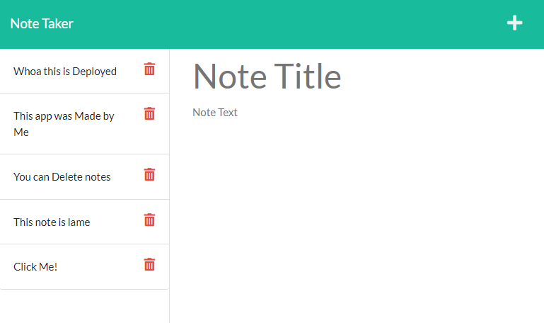

 

# M11 - Note Taker

## Description

Note Taker is a Web App saves notes and allows others to view said notes. It was made in order to practice Express. The application allows the user to create a note, save the note, and view previously saved notes by adding them to a database.

While building this project I learned to:
- Make a get, post, and delete request to an api
- Route those requests through various link extensions
- Serve dynamic html based on a back end database

### Built With

     

## Table of Contents
- [Installation](#installation)
- [Usage](#usage)
- [License](#license)
- [Contact](#contact)

## Installation

This is a deployed website so there is no true installation required

1. Navigate to [desolate-fjord-67880.herokuapp.com/](https://desolate-fjord-67880.herokuapp.com/)

(<a href="#readme-top">back to top</a>)

## Usage

Upon opening the website you will be greated with a home page. Click on the `Get Started` button in order to navigate to the next screen. You will be presented with a page that looks like this.

Once on that screen you are able to add information into `Note Title` and `Note Text`. In order to save your note click the floppy disk icon that appears at the top right. 

Now to view your note click on the tab that appears on the left side of your screen with the note title. 

Should you wish to delete your note simply click on the red trash can.

(<a href="#readme-top">back to top</a>)

## License

Distributed under the MIT License. See [LICENSE](./LICENSE) for more information.

(<a href="#readme-top">back to top</a>)

## Contact

For any further questions feel free to contact me via:
- GitHub: [Mateo-Wallace](https://github.com/Mateo-Wallace)
- Email: [mateo.t.wallace@gmail.com](mailto:mateo.t.wallace@gmail.com)
- LinkedIn: [Mateo Wallace](https://www.linkedin.com/in/mateo-wallace-57931b254/)

(<a href="#readme-top">back to top</a>)
